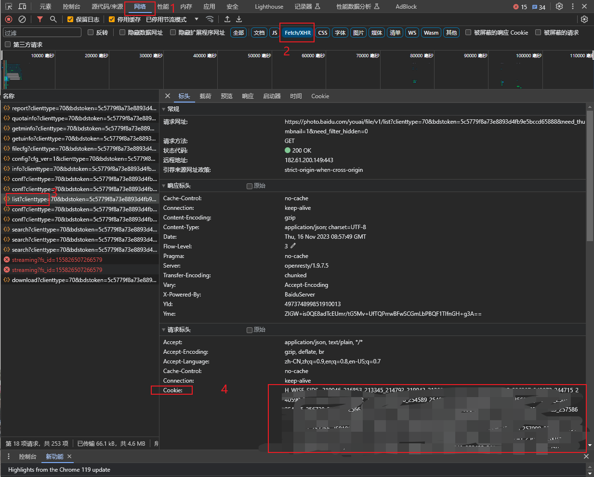
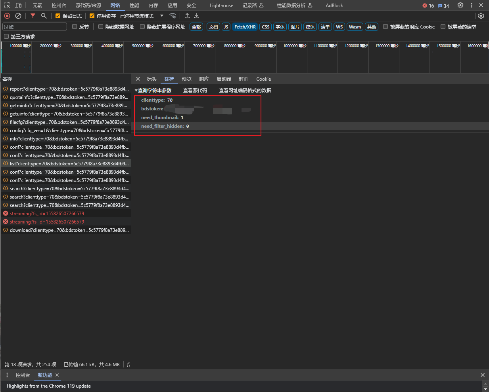

# BaiduPhoto
一键全部下载百度一刻相册中的所有图片

# 免责声明
本脚本仅仅用于快速下载一刻相册照片和视频，不得滥用以免加重百度服务器负担，不得用于窃取用户隐私，用户的一切行为与开发者无关。

# 运行环境：windows
项目运行需要有Python环境支持，如缺少相关的模块可参考下列解决方法：
```
以下快速方案，按需选一条即可：
安装到当前 Python 解释器
PowerShell 执行：py -m pip install -U pip requests
使用虚拟环境（推荐）
在项目根目录执行：
py -m venv .venv
.\.venv\Scripts\Activate.ps1
python -m pip install -U pip
pip install requests
然后在 IDE 里选择 .\.venv\Scripts\python.exe 作为解释器
如果已安装但仍报错
确认 IDE 选择的解释器与安装位置一致
重启 IDE
验证：python -c "import requests; print(requests.__version__)"
可选：在 requirements.txt 中加入 requests，以后用 pip install -r requirements.txt 安装。
```

# 使用说明
1. 在百度一刻相册浏览器端 https://photo.baidu.com/photo/web/home 按下F12，然后刷新
2. 按照以下流程获得Cookie
   
3. 获取表单数据
   
4. 将2、3步中找到的值填入settings.json对应位置，如果Cookie值中有双引号，则用转义字符\\"代替双引号"
5. 先运行FindPhotoList.py获得所有照片的fsid和其他信息（包括拍摄时间、地点等）
6. 再运行BaiduPhtot.py下载所有照片视频。此方法下载的就是原始文件。
